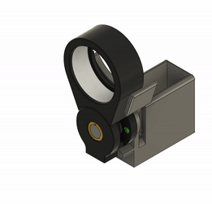
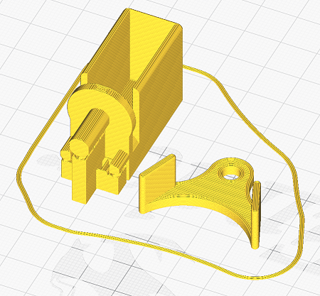

# Motorized flip mount

3D Printed micro-servo interface for the Thorlabs [TRF90/M](https://www.thorlabs.de/thorproduct.cfm?partnumber=TRF90/M):
## Features
 - 90° stable positions
 - Upgrade without changing the setup
 - No custom machining
 - Under 90€

## Parts
- Thorlabs TRF90/M
- RC Micro-servo MG90S or similar
- Two 3D printed pieces

## Assembly
 
 - Print the parts with suports.
 - Mount the "flipper" on the servo shaft.
 - Insert the servo into the holder. If is too loosen, add some tape to the sides of the servo to make it thicker so it sits tightly.
 - Align the optics carrier of the TFR90/M with the flipper position and slide in the assembly.
 - Tighten the screw on the side of the TFR90/M. (Use the provided allen key)
 - Try it and correct the flipper position/direction if necesary.
